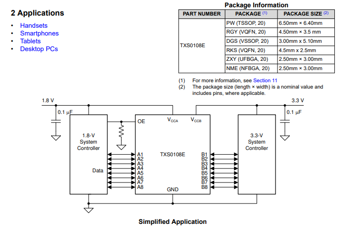
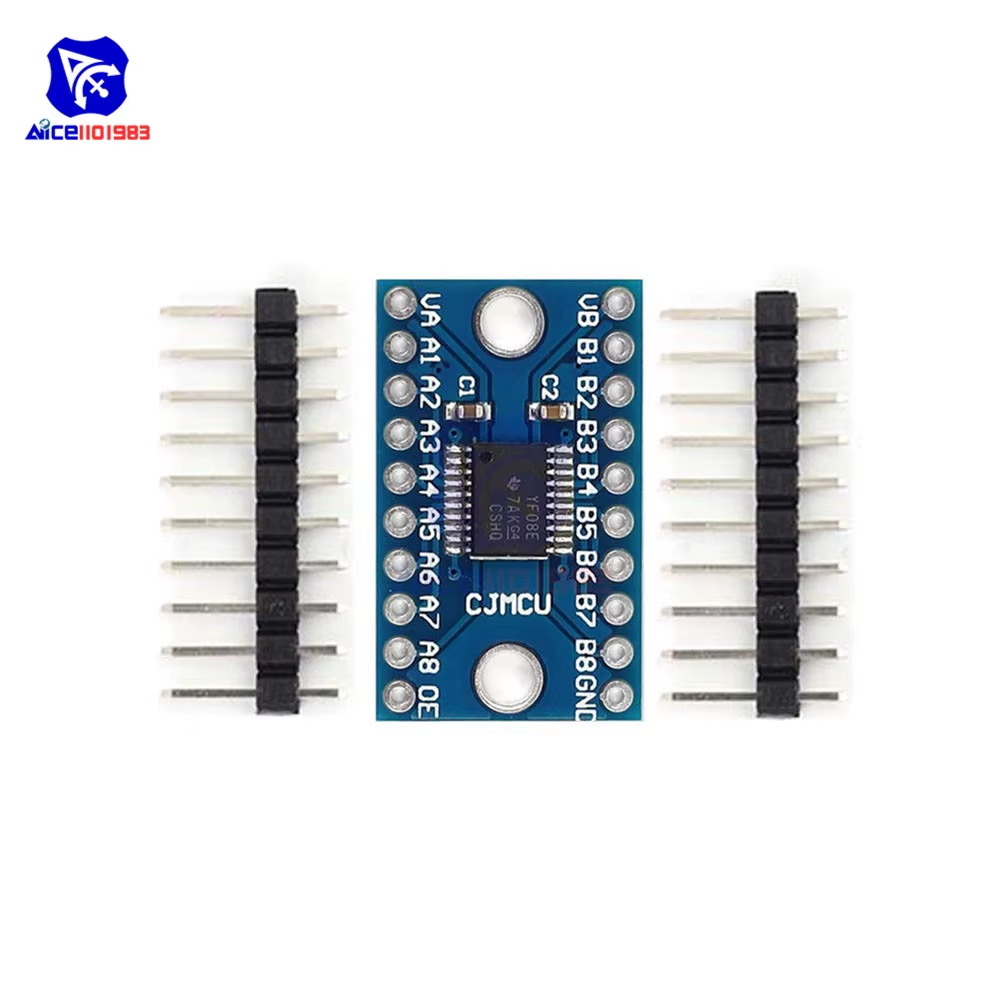
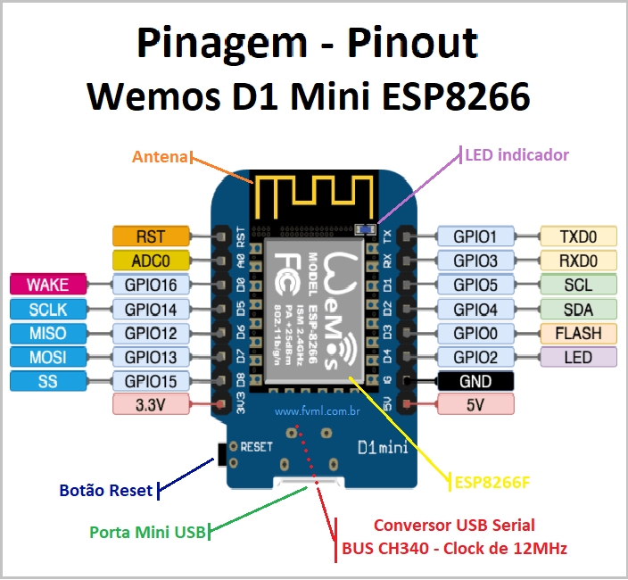
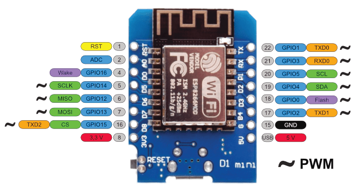
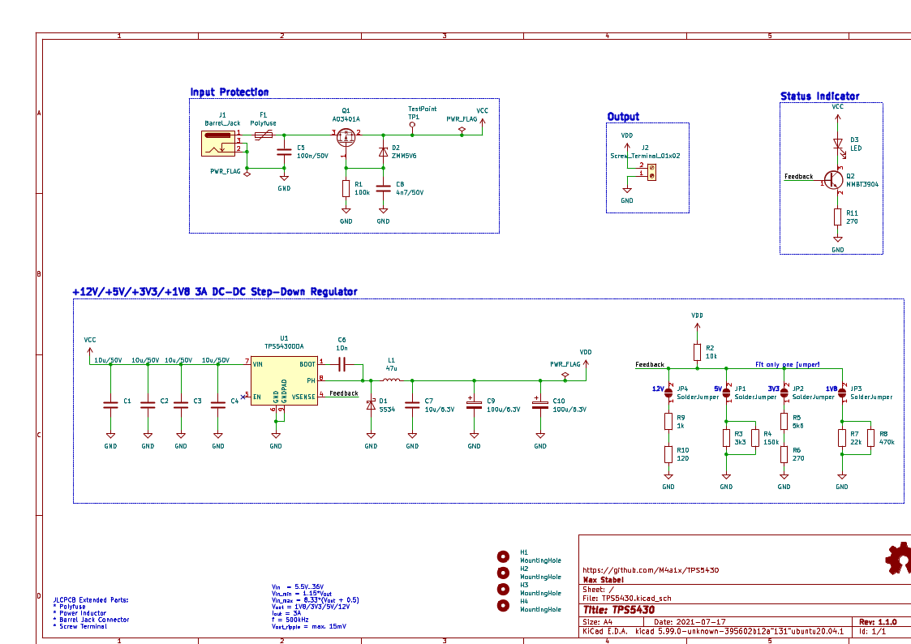
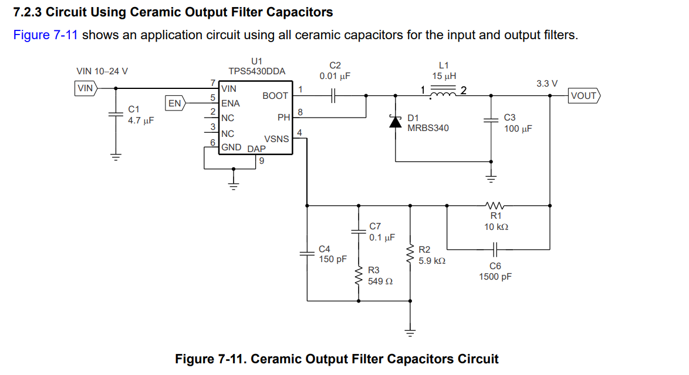
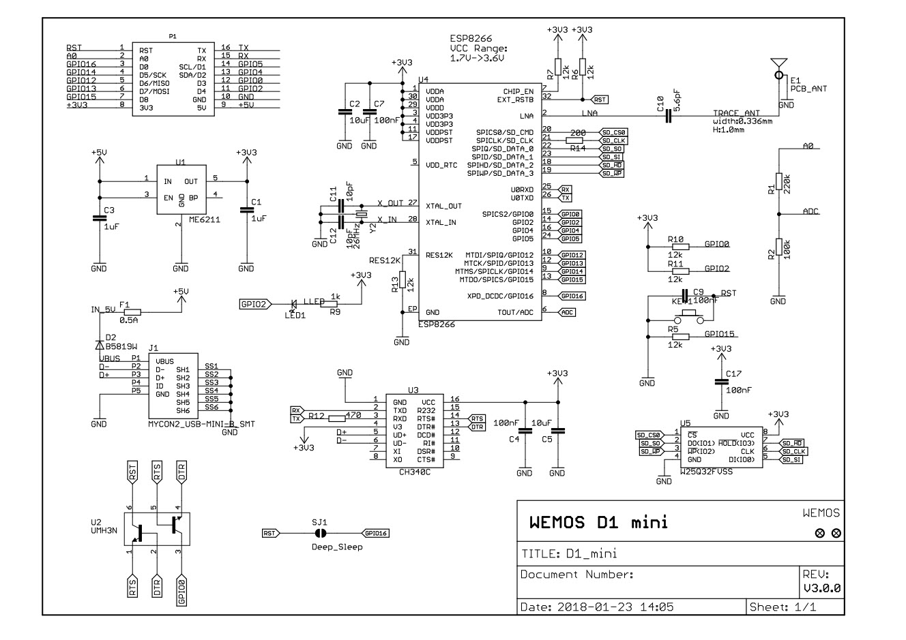
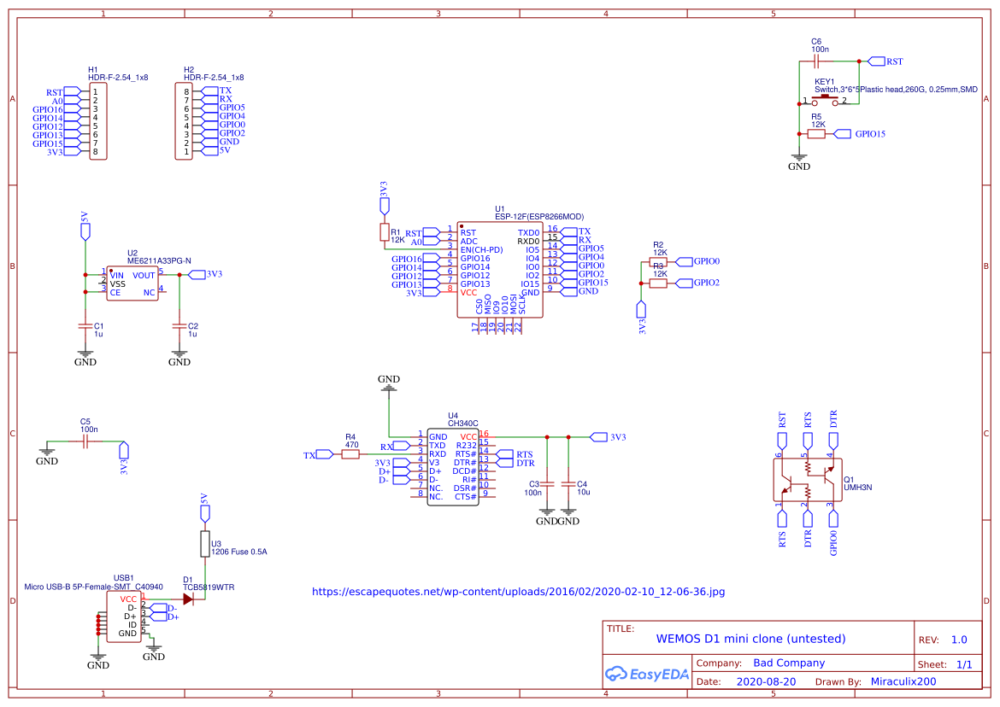

# protos 2 

## Electtonic design draft 

### CJMCU-0108 Module — Datasheet Summary

The **CJMCU-0108** is an 8-channel bidirectional logic level converter designed to safely interface devices operating at different logic voltages. It is based on the **Texas Instruments TXS0108E** IC.

#### Key Features (TXS0108E)

- Automatic bidirectional logic level shifting with no need for direction control
- Voltage ranges:
  - Port A (VCCA): 1.2V to 3.6V
  - Port B (VCCB): 1.65V to 5.5V
- Data transfer speeds:
  - Up to 110 Mbps in push-pull mode
  - Up to 1.2 Mbps in open-drain mode
- Output Enable (OE) pin puts all outputs into high-impedance state when LOW

#### Official Datasheet

Refer to the full TXS0108E datasheet from Texas Instruments:  
https://www.ti.com/lit/ds/symlink/txs0108e.pdf

## Node mcu d1 mini

### Pinout Table (2.54 mm headers)

| **Pin** | **Function**                         | **ESP8266 Pin** |
|--------:|--------------------------------------|-----------------|
| TX      | TXD                                  | GPIO1           |
| RX      | RXD                                  | GPIO3           |
| A0      | Analog input (max 3.2 V)             | A0              |
| D0      | IO                                    | GPIO16          |
| D1      | IO, SCL                               | GPIO5           |
| D2      | IO, SDA                               | GPIO4           |
| D3      | IO, 10k Pull-up                       | GPIO0           |
| D4      | IO, 10k Pull-up, BUILTIN_LED          | GPIO2           |
| D5      | IO, SCK                               | GPIO14          |
| D6      | IO, MISO                              | GPIO12          |
| D7      | IO, MOSI                              | GPIO13          |
| D8      | IO, 10k Pull-down, SS                 | GPIO15          |
| G       | Ground                                | GND             |
| 5V      | 5V output/input (USB-powered)         | –               |
| 3V3     | 3.3V output                           | 3.3V            |
| RST     | Reset                                 | RST             |

## 🧭 Table de correspondance D1 Mini – ESP8266 GPIO (avec RST/CLK modifiés)

| Nom silk (Dn) | GPIO | Fonctions spéciales       | LED intégrée | Utilisation actuelle       | Remarques critiques                        |
|---------------|------|----------------------------|---------------|-----------------------------|--------------------------------------------|
| D0            | 16   | WAKE, RTC                  | ❌            |                             | Pas de `PWM`, pas d'interruption           |
| D1            | 5    | I2C_SCL (par défaut)       | ❌            |                             | GPIO classique                             |
| D2            | 4    | I2C_SDA (par défaut)       | ❌            |                             | GPIO classique                             |
| D3            | 0    | FLASH button               | ❌            |                             | DOIT être **HIGH** au boot                |
| D4            | 2    | LED_BUILTIN                | ✅            |                             | DOIT être **HIGH** au boot                |
| D5            | 14   | SPI_CLK                    | ❌            |                             | Peut être utilisé en GPIO                  |
| D6            | 12   | SPI_MISO                   | ❌            | `RST_4017` (nouveau)        | GPIO OK                                    |
| D7            | 13   | SPI_MOSI                   | ❌            | `CLK_4017` (nouveau)        | OK, pas de contraintes                     |
| D8            | 15   | SPI_CS                     | ❌            |                             | DOIT être **LOW** au boot                 |
| RX            | 3    | Serial RX                  | ❌            |                             | UART0 RX                                   |
| TX            | 1    | Serial TX                  | ❌            |                             | UART0 TX                                   |
| A0            | A0   | ADC (0–1V)                 | ❌            |                             | Entrée analogique uniquement               |
| G             | —    | GND                        | —             |                             | Masse                                      |
| 5V            | —    | Alim 5V                    | —             |                             | Entrée ou sortie                           |
| 3V3           | —    | Alim 3.3V                  | —             |                             | Sortie régulée                             |
| RST           | —    | Reset                      | —             |                             | Tirer à GND pour reset                     |

---

### ⚠️ Broches critiques au démarrage

| GPIO | État requis au boot | Danger si incorrect |
|------|----------------------|----------------------|
| GPIO0 (D3) | **HIGH**         | Boot en mode flash  |
| GPIO2 (D4) | **HIGH**         | Boot échoue         |
| GPIO15 (D8)| **LOW**          | Boot échoue         |

---

### ✅ Broches recommandées pour signaux actifs

Utilise de préférence : `D1`, `D2`, `D5`, `D6`, `D7`  
Évite : `D3`, `D4`, `D8` (à moins de gérer leur état au boot)

  

## pcb project

1. **Power Supply**
   - Battery: LiPo 2S (7.4V nominal, 8.4V max)
   - Charger: Include footprint/header for a LiPo 2S balance charger (e.g. TP4056 BMS with balancing)
   - Regulator 1: LM2596 for 5V (servo power)
   - Regulator 2: LM2596 for 5V logic/ICs
   - GND is common between both power rails

1. **Power Suply alternative**
   -  TPS5430
   - https://www.ti.com/lit/ds/symlink/tps5430.pdf?ts=1743348483549

2. **Microcontroller**
   - ESP8266 D1 Mini
   - Do **not** assign CLK or RST pins yet for the CD4017s; route them to jumpers/pads with pull-downs or solder bridges

3. **Servo Control (Multiplexed)**
   - CD4017 x2 (one active, one spare with unconnected CLK/RST)
   - Q0 to Q7 routed to TXS0108E level shifter (3.3V to 5V)
   - From level shifter to servo signal pins

4. **Signal Level Shifting**
   - TXS0108E
     - Side A: 3.3V logic (ESP8266/CD4017 outputs)
     - Side B: 5V logic (servo PWM input)
     - Direction handled automatically by TXS0108E

5. **Servo Connectors**
   - 8x 3-pin headers (Signal, VCC, GND)
   - Footprints for JST-SH or JST-XH (selectable via solder jumper or dual footprint)
   - Servo power sourced from 5V (regulator 1)

6. **Headers / Expandability**
   - Spare GPIO header (e.g. for I2C)
   - Test points for CLK/RST of second CD4017
   - Pull-down resistor footprints for optional CLK/RST input disabling

7. **Mechanical/Footprint**
   - Board shape = rectangular, ~30mm x 90mm
   - Mounting holes 4x M2
   - Clear silk labels: power zones, signal directions, jumper configs

8. **Other Components**
   - Decoupling caps for ESP, CD4017, TXS0108E
   - 100uF electrolytic near each LM2596 output
   - Input protection diode for reverse polarity (Schottky recommended)

## power suply

Be sure to read the datasheet the sample imlementation give a power input very high

datasheet https://www.ti.com/lit/ds/symlink/tps5430.pdf?ts=1743348483549

sample of schematic for TPS5430  

### 3.3v  datasheet implementation sample 

## wemos mini d1 schematic  esp8266 + ch340g  ref designs 

